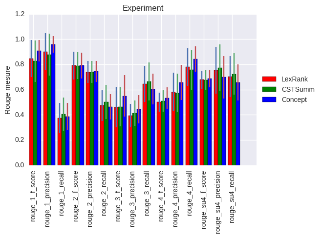
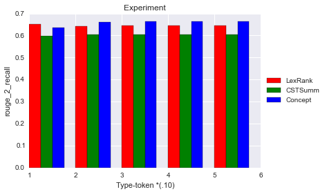
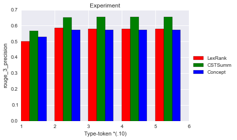

# Graph-based conceptual centrality as salience in extractive text summarization

## Automatic text summarization (AS)

Automatic Text Summarization (AS) is a Natural Language Processing (NLP) task that aims to reduce the amount of text into a shorter version while preserving the core information content \cite{nenkova2011automatic}.
This kind of shorter text is useful for many daily activities, since the amount of information is growing, and we cannot get all the news by reading all the texts that are being published in one day.
This work in progress presents a proposal aimed to minimize problems related to AS, since some extractive techniques are not totally prepared to handle with some issues, such as typos, synonyms and other orthographic variations.

## Vector Space Model
Related work in this area relies on the Vector Space Model (VSM), to represent the content and relationship of texts. This representation implies a mesure of similarity that can be based on the cosine similarity. However this similarity in VSM can be influenced by problems derived from NLP.
In order to minimize this problems, our research uses concepts, instead of words to describe the content of summaries.

## Summarization
Is the process of reducing a textual document in order to create a summary that retains the most important points of the original document. **Summary** is the result of the summarization process.

* Purpose relation
    * Indicative summary: this kind of summary only indicates which part of the texts should be read by the user.
    * Informative summary: this summary replaces the original document

* Summary and original text relation
    * Extractive summary: it selects a couple of relevant sentences, based on statiscal analysis.
    * Abstractive summary: attempts to understand the central concepts from the document, creating a totally new text.

* Input document relation
    * Single document: the sentences are extract from one only text.
    * Multi-document: the information can be digested from multiple text sources into one single document.
    
* Language relation
    * Monolingual: the output language is the same as the input text language.
    * Multilingual: the output language can be the same as the input language, but it can work in more than one language.
    * Cross-lingual: it get a source text in a particular language and built the summary in another language.
    
## Model and representation
Extractive summarization relies on graph representation of documents for computing relative importance (salience) of its textual units[Erkan and Radev 2004]. That representation consists in sentences being representated as nodes and its similarity are represented by edges. The salient nodes represent the most representative sentences, which should be included in the final summary.
- There are two points that should be considered in the definition of centrality.
    - How to define the similarity between two sentences;
    - How to compute the overall (global) centrality of a sentence

## Similarity mesures
Answering about the points above, the similarity between two sentences can be defined as the amount of information in commom that they share. For example, to define the similarity between two sentences using the **cosine between two vectors**, defined by the value of the corresponding dimension of the vector representation of the sentence (number of ocurrence of the word in the sentence * idf of the word) can be affected by NLP problems, as we mentioned before.

**Concepts** represent real world attributes and they help understanding ideas and ideologies present in texts. Concepts are not in the same level of terms of words, so it can minimize the vocabulary problem, and the effort necessary to extract useful information.
The first thing to do is to identify or extract concepts from documents (in our case, sentences). To do it is sugested by [Loh et al. 2000] applying an automatic **categorization** task. 
- This categorization is guided by a set of *rules* that describe how a concept should be identified.
- These rules include cue *terms* that once found in a document may indicate the presence of concept.
- The terms may include synonyms, lexical variations and derivations, and semantic related words.
- Each term has an weight associated that correspond to the relative importance of this term from 0 (irrelevant) to 1 (relevant). It can be manually assigned or can use learning process.
Once the concepts are identified, we can identify the similarity among the concepts of each sentence. To do this we calculate the grade of similarity (gs) between two vectors (v1, v2).

## Evaluation strategies
A good summary contains
- Coverage - Contain the main topics of the original document.
- High diversity - Keep the redundancy to a minimum.
- High coherence - Have smooth connection among sentences.
There are many methods to perform intrinsec evaluation, but in our work we will be using [ROUGE](http://anthology.aclweb.org/W/W04/W04-1013.pdf) method, which is inspired by the success of the BLUE evaluation, using n-gram overlaps as the basis of mesure. It will be more explained in the next section.

## ROUGE
ROUGE stands for Recall-Oriented Understudy for Gisting Evaluation, this method mesure the quality of a summary by comparing it to other summaries created by humans. The mesures count the number of overlapping units such as n-gram, word sequences and word pairs between the computer generated summary and the ideal one.

Rouge has four different mesures:

* ROUGE-N: N-gram Co-Ocurrence Statistics
Is an *n-gram* recall between candidate summary (generated) and a set of reference summaries. In its computation, n stands for the length of the n-gram, and gram-m is the maximum number of n-gramns.
*n-gram is a contiguous sequence of n items from a given sequence of text.

ROUGE-N is a recall-related mesure because the denominator of the equation is the total sum of the number of n-gram ocurring in the **reference** summary side.

Knowing about that, we can notice that the number in the denominator of the rouge-n formula increases as we add more references. When we add a reference summary into the pool, we expand the space of alternative summaries, and by controling this we can design evaluations that focus on different aspects of summarization.

When using multiple references, we compute pairwise summary-level rouge-n between a candidate summary s and every reference, in the reference set.

* ROUGE-L: Longest Common Subsequence
Given two sequences X and Y, the longest common subsequence (LCS) of X and Y is a common subsequence with maximum length. When we apply LCS in summarization evaluation, we view a summary sentence as a sequence of words.

* ROUGE-W: Weighted Longest Common Subsequence
This method improve the basic LCS method, it add an weight to remember the lenght of consecutive matches encountered so far to a regular two dimensional dynamic program table computing LCS.

* ROUGE-S: Skip-Bigram Co-Occurrence Statistics
Skip-bigram is any pair of words in their sentence order, allowing for arbitrary gaps. Skip-bigram co-occurrence statistics measure the overlap of skip-bigrams between a candidate translation and a set of reference translations.
Example: 

S1 - police killed the gunman

S1 has six skip-bigrams: police killed, police the, police gunman, killed the, killed gunman, the gunman.

* ROUGE-SU: Extension of ROUGE-S
For example, when we get the inverse of S1, in this case S2, and there's no skip-bigram match between them. But, we would like to differentiate sentences similar to S2 from sentences that do not have single word occurence with S1.

S2 - gunman the killed police

To achieve this, we extend ROUGE-S with the addition of unigram as counting unit.

## CSTNews
CSTNews is a discourse-annotated corpus for fostering research on single and multidocument summarization. The corpus comprises 50 clusters of news texts in Brazilian Portuguese and some related material. It is composed of 50 clusters of news texts in Brazilian Portuguese (BP), which each cluster comprising 2 or 3 texts collected from on-line Brazilian news agencies as *Folha de São Paulo*, *Estadão*, *O globo*, *Gazeta do Povo* and *Jornal do Brasil*.

The texts are annotated in different ways for discourse organization, following both the Rhetorical Structure Theory (RTS) and Cross-document Structure Theory (CTS).

* RTS - Is a theory of text organization based upon its underlaying propositions and their functions (proposições subjacentes e suas funções). It prescribes a way to retrieve and generate relationships among propositions under the assumption that the writer rhetorically organizes a text based upon his/her intentions towards the reader.
* CTS - Is a way of relate text passages from different texts on the same topic. It was devised mainly for dealing with multi-document organization, and may be used to solve several problems such as summarization and question-answering ones. Although seeming simpler than RTS, involves difficult issues concerning its set of relations.

## Tasks

- [x] attempt to adjust the lexRank algorithm to concept version
- [x] write about the project, to clear things
- [x] collect results for our algorithm to one document
- [x] collect results for our algorithm for all CST documents.
- [x] bar graph representando média de valores pra todas as métricas pra todos os valores.
- [x] media com desvio padrao.
- [ ] improve rouge s and su definition - what we are using
- [ ] write about the rouge mesure meanings and precision and recall definition
- [ ] add explanation "about the work" picture (PageRank - extrair saliência do grafo)
- [ ] write about the result obtained

## Experiments and Evaluation Results

In our experiments we used the [CSTNews corpus](http://conteudo.icmc.usp.br/pessoas/taspardo/rst2011-cardosoetal1.pdf) and evaluate the summarization between human extract and CSTSumm, Concept Rank and LexRank methods. The CSTNews corpus is composed of 50 groups of news articles written in Brazilian Portuguese collected from several sections (Politics, Sports, World, Daily News, Money and Science) of mainstream online news agencies (Folha de São Paulo, Estadão, O Globo, Jornal do Brasil and Gazeta do Povo). Specifically, each group of 2 or 3 sources texts on the same topic from diferent agencies (in a total of 140 documents) and a multi-document human abstract for each group.

To generate automatic summaries we used three methods of extractive summarization: [CSTSumm](http://seer.ufrgs.br/index.php/rita/article/view/RITA-VOL23-NR1-183/37492), Concept Rank, a method that we are proposing, and LexRank, a traditional method to extract summaries.

To compare the quality of the automatic and the human generated extract, we used the evaluation method [ROUGE](http://anthology.aclweb.org/W/W04/W04-1013.pdf), the measures count the number of overlapping units such as n-gram, word sequences and word pairs between the computer-generated summary to be evaluated and the ideal summaries created by humans.

Evaluating all those methods, our average results are:
- Resultados de média que tínhamos antes, com desvio padrão, com análises

And by notable results we discovered that:

1 - Recall for rouge2 mesure gave us great results for ConceptRank
- Recall para rouge 2 obteve bons resultados. (gráfico do email)
- Significância estátistica pro resultado do rouge 2

2 - ConceptRank shows a great result when the realtion type-token is very low.
- Type-token: existe melhora onde a relação type-token é muito baixa
- type-token: relação entre tamanho do vocabulário pelo tamanho de palavras (tokens)

